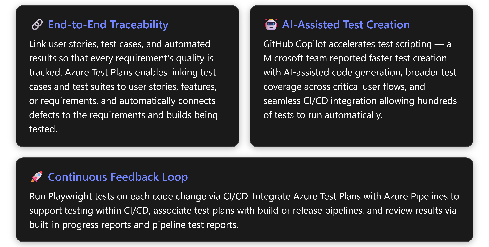
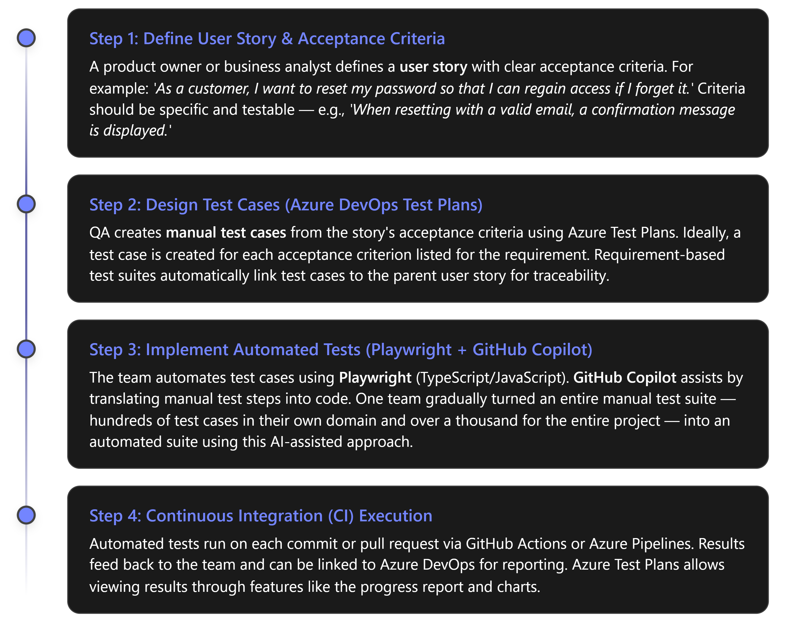

# **Playwright 101**: From User Stories to Automated Tests with GitHub Copilot & Azure DevOps

**Overview:** This guide outlines a 1-hour "Playwright 101" workshop designed for manual QA professionals transitioning to end-to-end test automation. The workflow progresses from **user stories** and **manual test cases** (managed in Azure DevOps Boards & Test Plans), through **Playwright** automated test implementation — accelerated by **GitHub Copilot** in VS Code — to execution in **CI pipelines** (GitHub Actions or Azure Pipelines). Core concepts for the 1-hour session are emphasized throughout; optional demos, hands-on labs, and advanced reference material are clearly marked for extended or self-paced exploration.

<!-- Copilot-Researcher-Visualization -->



***

## The Quality Workflow at a Glance (Story → Test → Automation → CI)

<!-- Copilot-Researcher-Visualization -->



The core workshop covers **Steps 1–4** conceptually. Optional content (demos and labs) provides deeper implementation practice. Each step is detailed below.

***

## 1. From User Story to Test Case (Requirements → Test Plans)

**Core (must-cover).** Azure Test Plans provides browser-based test management supporting planned manual testing, user acceptance testing, exploratory testing, and stakeholder feedback. The key activity in this step is translating user story acceptance criteria into structured, traceable test cases.

### How Azure Test Plans Organizes Testing

Every major milestone in a project should have its own **test plan**. Within each test plan are **test suites** — collections of **test cases** designed to validate a work item such as a feature implementation or bug fix. Each test case confirms a specific behavior and may belong to one or more test suites. Azure Test Plans supports three types of suites:

*   **Requirement-based suites** — automatically linked to a user story or requirement, so every test case in the suite is traceable to that work item.
*   **Static suites** — where cases are manually assigned, useful for regression sets.
*   **Query-based suites** — populated dynamically from a work item query.

The Azure DevOps Hands-on Lab illustrates this concretely: for the story\*"As a customer, I want to manage product inventory efficiently,"\* a requirement-based test suite contains six test cases designed to confirm the expected behavior of that feature implementation.

### Traceability: Connecting Stories, Tests, and Results

Three practical benefits emerge from this linkage:

1.  **Traceability** — link requirements (Azure Boards) to automated tests and the pipeline that ran them. By mapping the two, you establish the quality of requirements based on test results.
2.  **History** — Azure Test Plans allows viewing results through features like the progress report and charts, rather than drilling into every pipeline run.
3.  **Test inventory** — track the status of each test case (not automated, planned to be automated, or automated), making it easy to measure how many manual tests have been converted to automated and how many remain.

Azure DevOps also enables linking test cases and test suites to user stories, features, or requirements for end-to-end traceability. It automatically links tests and defects to the requirements and builds being tested. Teams can track testing of requirements with pipeline results and the Requirements dashboard widget.

> 💡 **Tip — Write Specific Acceptance Criteria:** Clear criteria lead to clearer test cases and smoother automation. The Azure DevOps blog post on AI-generated automation emphasizes this trade-off: either improve your test cases in Azure DevOps by writing clearer, more detailed steps, or spend more time fixing the generated scripts later. Examples of vague vs. specific steps are provided in that post to illustrate the difference.

### Access Requirements

Azure Test Plans functionality varies by access level. Test planning tasks (creating test plans, suites, managing configurations) require the **Basic + Test Plans** access level. Exploratory testing with the Test & Feedback extension is available at the **Stakeholder** level and above. Running tests via Test Runner requires at least **Basic** access.

**Optional Demo:** Walk through creating a user story in Azure Boards, adding acceptance criteria, then navigating to Test Plans to create a requirement-based test suite and add test cases in grid view. The Azure DevOps Labs exercise demonstrates this flow with the eShopOnWeb sample project.

***

## 2. Implementing Automated Tests with Playwright

**Core (must-cover).** Once test cases are defined, the team automates them with **Playwright** — a modern open-source end-to-end testing framework from Microsoft.

### Why Playwright?

Playwright was built by the team behind Puppeteer and extends beyond it with multi-browser support. Enterprise teams have found that a major pain point of Selenium is its flaky and unreliable nature — failures without actual issues that become efficiency blockers. Playwright's reliability and community support (similarity with Puppeteer) drove adoption as a replacement.

**Key capabilities** (from internal enterprise UX Automation Framework Guidance):

| Capability           | Detail                                                                  |
| -------------------- | ----------------------------------------------------------------------- |
| **Cross-browser**    | Supports Chromium, WebKit, and Firefox                                  |
| **Cross-platform**   | Test on Windows, Linux, and macOS, locally or on CI, headless or headed |
| **Cross-language**   | APIs available in TypeScript, JavaScript, Python, .NET, Java            |
| **Mobile Web**       | Native mobile emulation of Google Chrome for Android and Mobile Safari  |
| **Built-in tooling** | Codegen, Trace Viewer, MCP server, and more                             |

The Playwright open-source repository on GitHub has over **86.8k stars** and is maintained by Microsoft. Enterprise adoption within Microsoft is significant — the PowerApps group has incorporated Playwright into integration tests across PR, CI, nightly, smoke testing, outside-in, performance, and accessibility pipelines, and teams have been transitioning from New Relic, Cypress, and Selenium to Playwright.

### Playwright Test Structure — A Concrete Example

A typical Playwright test in TypeScript mirrors manual test steps directly:

```typescript
import { test, expect } from '@playwright/test';

test('Reset password email is sent for valid user', async ({ page }) => {
  // Navigate to the login page
  await page.goto('https://example.com/login');
  // Trigger "Forgot Password" flow
  await page.click('text=Forgot password');
  // Fill in the email field
  await page.fill('input[name="email"]', 'user@example.com');
  // Submit the form
  await page.click('button:has-text("Send Reset Link")');
  // Verify success message appears
  await expect(page.locator('.alert-success')).toContainText('reset link sent');
});
```

*Listing 1: Sample Playwright test in TypeScript.* Key points:

*   **`test(...)`** defines a test case with a descriptive title matching the user story scenario.
*   **Selectors** — text selectors (`'text=Forgot password'`) and attribute selectors (`input[name="email"]`). Robust selector strategies with multiple fallbacks are recommended for enterprise-grade tests【1†L100】.
*   **Assertions** — `expect(...)` verifies outcomes. Verification/assertion steps should match the test case acceptance criteria【1†L110】.
*   **Auto-waiting** — Playwright waits for elements to be ready, reducing flakiness without explicit sleep statements.

### Recommended Test Patterns

For larger test suites, the enterprise guidance recommends the **Page Object Model (POM)** pattern, which segregates UI element details from test logic and improves maintainability【5000†L380-L383】. The internal Playwright framework's onboarding guides cover Installation, Configuration (test agent pools, geo-specific settings, authentication scenarios), Writing Tests, Best Practices, and Types of Integration Tests【5000†L96-L110】.

Each test should also include: retry mechanisms for flaky UI elements, explicit waits for network idle and page load states, clear logging of each test step, detailed error reporting and screenshots on failure, handling of unexpected dialogs or notifications, and timeout handling with clear error messages【1†L116-L124】.

> **Note on Scale:** One internal team built **168 Playwright-automated tests** with quality reports, screenshot capture, and dashboards — all powered by GitHub Copilot CLI — to systematically find bugs, track quality over time, and share results with engineering and leadership【5000†L145-L148】.

***

## 3. Leveraging GitHub Copilot for Test Development

**Core (must-cover).** A distinguishing feature of this workshop is demonstrating how **GitHub Copilot** — an AI pair-programmer integrated into VS Code — accelerates Playwright test authoring, from generating test scaffolding to refactoring and maintaining tests.

### How Copilot Assists Test Creation

Copilot can suggest Playwright code as you type, based on comments, function names, and the context of your open files. The most impactful workflow, however, involves structured prompting:

**Two-Prompt Approach (from the Azure DevOps team):** A Microsoft team documented a repeatable process for converting manual test cases to Playwright scripts using Copilot and the Azure DevOps MCP (Model Context Protocol) server【1†L16-L17】:

*   **Prompt 1 — Retrieve test case details:** Ask Copilot to fetch test case information from Azure DevOps without taking action yet. The prompt specifies the ADO Organization, Project, Test Plan ID, and Test Suite ID【1†L55-L67】.
*   **Prompt 2 — Generate Playwright script:** Instruct Copilot to act as "an experienced Software Engineer" writing high-quality Playwright test scripts in TypeScript based on the retrieved test cases. The prompt includes project context (folder paths for authentication helpers, existing sample tests, Playwright config), test structure requirements (`test.describe()` blocks, proper authentication setup, robust selector strategies), and robustness requirements (retry mechanisms, multiple selector strategies, explicit waits)【1†L76-L110】.

By following this loop for each test case — and it can be done in bulk by passing an entire Test Suite to GitHub Copilot — the team gradually turned an entire manual test suite into an automated one. They had hundreds of test cases for their own domain and over a thousand test cases for the entire project【1†L29】. The MCP server and Copilot handled the heavy lifting of writing code, while the team oversaw the process and made minor adjustments【1†L29】.

### Prompt Engineering Lessons Learned

The same team documented critical lessons:

*   **"Prompt is the king"** — breaking the task into two prompts ("fetch test case" then "generate script") produced more reliable code than a single combined prompt. The exact wording matters:*"convert the above test case steps to Playwright script"* worked better than vaguer commands. Pointing the model to relevant code and existing tests improved accuracy of generated scripts【1†L33】.
*   **Quality of context is a trade-off:** either invest time in writing clearer, more detailed test case steps in Azure DevOps, or spend more time fixing generated scripts later【1†L34-L37】.
*   **Non-textual steps are a limitation:** the current Copilot agent cannot interpret images or visual assertions — if a test step says "compare screenshot," the AI will not perform image comparison. The workaround is to adjust such steps to something verifiable via DOM or data, or use Playwright's screenshot assertions with predefined baseline images【1†L41】.

### Quality and Verification

Copilot output is a first draft that requires human review. Selectors may not match the actual application DOM, and generated code might not follow team conventions. The results improve significantly when the prompts include references to existing test files and project structure, giving the AI more accurate context【1†L33】.

**Demo (core):** Live in VS Code, type comments describing test steps and watch Copilot suggest corresponding Playwright calls. Show how editing prompts and providing project context files improves suggestion quality.

**Optional (advanced) — MCP Integration:** The Azure DevOps MCP server integration with GitHub Copilot is an emerging capability that allows Copilot to fetch work items directly from Azure DevOps and generate tests based on them【1†L16-L17】. On-demand test execution directly from the Azure Test Plans experience is also planned, with associating Playwright JS/TS tests with manual test cases coming soon【1†L21】.

***

## 4. Continuous Integration: Running Playwright Tests in CI/CD

**Core (must-cover).** Automated tests deliver their full value when executed continuously. Both **GitHub Actions** and **Azure Pipelines** can run Playwright test suites on every code change.

### Fundamental CI Steps for Playwright

Regardless of platform, the pipeline requires:

1.  **Install dependencies** — Node.js, project packages (`npm install`), and Playwright browsers.
2.  **Run tests** — typically `npx playwright test` with a reporter configured (JUnit XML, HTML).
3.  **Collect results/artifacts** — save reports and failure screenshots for post-run analysis.
4.  **Set pipeline status** — fail the pipeline if any tests fail, blocking the merge.

### GitHub Actions Example

```yaml
# .github/workflows/playwright-tests.yml
name: Playwright Tests
on: [push, pull_request]
jobs:
  ui-tests:
    runs-on: ubuntu-latest
    steps:
      - uses: actions/checkout@v3
      - name: Install dependencies
        run: npm install
      - name: Run Playwright tests
        run: npx playwright test --reporter=junit
      - name: Upload Test Results
        uses: actions/upload-artifact@v3
        with:
          name: junit-results
          path: playwright-report/junit-results.xml
```

*Listing 2: Sample GitHub Actions workflow for Playwright tests.*

### Azure Pipelines Example

For Azure Pipelines, the equivalent uses YAML tasks with an additional step to surface results in the Azure DevOps Test tab:

```yaml
- task: PublishTestResults@2
  inputs:
    testResultsFiles: '**/junit-results.xml'
    testRunner: JUnit
```

Including the `PublishTestResults` task publishes results to Azure DevOps's built-in test reporting UI, enabling teams to view failures, trends, and analytics directly within the pipeline run.

### Choosing Between GitHub Actions and Azure Pipelines

The choice depends on organizational context and integration needs:

| Factor                       | GitHub Actions                                                                                    | Azure Pipelines                                                                                        |
| ---------------------------- | ------------------------------------------------------------------------------------------------- | ------------------------------------------------------------------------------------------------------ |
| **Best fit**                 | Code already on GitHub; team wants single-platform developer experience                           | Team uses Azure Boards + Test Plans; needs unified test management                                     |
| **Test reporting**           | Relies on artifacts, annotations, or third-party actions for dashboards                           | Built-in Test Results tab with pass/fail trends, flaky-test detection, and analytics【16†L33】           |
| **Test Plans integration**   | Requires custom integration (REST API or reporter) to update Azure Test Plans                     | Native integration: publish results to Test Plans, link to requirements, view progress reports【16†L31】 |
| **Traceability**             | PR status checks (✔️/❌); requires extra setup for requirement-level tracking                      | Automatic linking of test results to requirements and builds being tested【16†L32】                      |
| **Marketplace / extensions** | Large marketplace of community-built actions                                                      | Mature task ecosystem with Microsoft-maintained tasks for test publishing, deployment gates            |
| **Hybrid option**            | Azure Pipelines can run against GitHub-hosted repos, enabling GitHub for source + Azure for CI/CD | GitHub Actions can trigger Azure DevOps work item updates via API                                      |

**Practical guidance:** If requirements traceability and integrated manual + automated test management are priorities, Azure Pipelines with Azure Test Plans provides the tightest feedback loop. If the goal is developer-centric simplicity with code and CI in one platform, GitHub Actions is effective — and can be supplemented with the `playwright-azure-reporter` package to push results to Azure Test Plans when needed【4†L27-L28】.

### Advanced: Linking Automated Tests to Azure Test Plans

The `playwright-azure-reporter` npm package is a custom Playwright reporter that publishes test results by annotating the test case name with the Azure Test Plan ID【4†L27-L28】. The setup involves:

1.  Manually creating test cases in Azure Test Plans, noting each test case's ID (e.g., 444, 445)【4†L38-L39】.
2.  Adding the ID in brackets to the Playwright test title — e.g., `[444] Reset password email is sent`【4†L39】.
3.  Configuring `playwright-azure-reporter` in `playwright.config.ts`【4†L34】.

When these tests run, the outcome for each test case appears directly in Azure Test Plans【4†L41】. The pipeline can also use the JUnit reporter to publish results to the pipeline's Test tab simultaneously【4†L43】.

**Future: Native Playwright JS/TS Support in Azure Test Plans.** Currently, Azure DevOps supports associating VSTest automated tests to test cases in Test Plans. Microsoft is expanding the list of supported frameworks to allow linking and executing automated tests written in JavaScript (Playwright), with association performed directly in Azure DevOps【10†L8】. This roadmap item (last updated April 22, 2025) will eliminate the need for custom reporters for basic test-to-requirement linking【10†L40】.

***

## 📋 Optional Demos & Labs (Beyond the Core Session)

*The following activities supplement the core 1-hour workshop for those seeking hands-on practice or deeper engagement:*

*   **Hands-on Lab 1 — Writing Your First Playwright Test:** Take a sample user story, write a manual test case, then automate it with Playwright. Use the Playwright VS Code extension's code generator (`codegen`) to record interactions, then refine the generated script. (Maps to Steps 1–3.)

*   **Hands-on Lab 2 — GitHub Copilot in Action:** In VS Code, start with a partially written test (comments describing steps but no implementation) and invoke Copilot suggestions. Practice the two-prompt approach: first describe context, then request script generation. Evaluate and refine the output.

*   **Demo — CI Pipeline Setup:** Walk through adding the GitHub Actions YAML to trigger automated test runs on a pull request. Show the pipeline executing and test results surfacing. For Azure Pipelines, demonstrate the Test Results tab and how it links to Test Plans.

*   **Advanced — Azure Test Plans Reporter Integration:** Outline the `playwright-azure-reporter` configuration and demonstrate how test case IDs in test titles update Azure Test Plans results automatically【4†L27-L34】.

*   **Enterprise Context — Existing Workshop Schedule:** This Playwright 101 session complements an existing workshop delivery plan that includes "Test Automation Workflow (Selenium, Playwright, Micro Focus UFT PoC)" in Week 8, "QA Process Review + Azure DevOps Enablement" in Week 15, and "QA Optimization + Migration from ALM" in Week 16【5000†L41-L49】. Participants are encouraged to attend these related sessions for deeper organizational context.

### Suggested GitHub Repository Structure

    playwright-101-workshop/
    ├── README.md                      # Workshop instructions and pointers
    ├── user-stories/                  # Sample user story definitions
    ├── manual-test-cases/             # Example test case designs (or ADO export)
    ├── playwright-tests/              # Automated Playwright tests
    │   ├── tests/
    │   │   └── reset-password.spec.ts
    │   ├── playwright.config.ts
    │   └── package.json
    ├── .github/
    │   └── workflows/
    │       └── playwright-tests.yml   # GitHub Actions CI pipeline
    ├── azure-pipelines.yml            # Azure Pipelines CI (alternative)
    └── docs/
        ├── copilot-prompt-examples.md # Prompt templates for Copilot
        ├── playwright-tips.md         # Selector strategies, debugging
        └── ado-integration.md         # Azure Test Plans reporter setup

***

## 📚 Learning Resources

A curated list of high-quality resources, grouped by topic, with audience level indicated:

### Playwright Fundamentals

| Resource                                                                                                   | Type   | Level      | Description                                                                                                                                                   |
| ---------------------------------------------------------------------------------------------------------- | ------ | ---------- | ------------------------------------------------------------------------------------------------------------------------------------------------------------- |
| **[Build your first end-to-end test with Playwright](https://learn.microsoft.com)** (Microsoft Learn)      | Module | Beginner   | 1 hr 4 min module, 8 units. Covers using Playwright to test a sample web app, running tests, viewing reports, and understanding project structure【6†L12-L13】. |
| **[Playwright Official Documentation](https://playwright.dev)**                                            | Docs   | All levels | Getting started guides, API reference, best practices, learn videos, and community demos【6†L18-L19】.                                                          |
| **[Use Playwright to automate and test in Microsoft Edge](https://learn.microsoft.com)** (Microsoft Learn) | Guide  | Beginner   | Covers installation, running basic tests, and running tests in Microsoft Edge specifically【6†L33-L34】.                                                        |

### GitHub Copilot & AI-Assisted Testing

| Resource                                                                                                                                                                                        | Type  | Level      | Description                                                                                                                                                                                                                        |
| ----------------------------------------------------------------------------------------------------------------------------------------------------------------------------------------------- | ----- | ---------- | ---------------------------------------------------------------------------------------------------------------------------------------------------------------------------------------------------------------------------------- |
| **[Test like a pro with Playwright and GitHub Copilot](https://learn.microsoft.com/en-us/shows/visual-studio-code/test-like-a-pro-with-playwright-and-github-copilot)** (Microsoft Learn Shows) | Video | Beginner   | Nov 27, 2024. Debbie O'Brien demonstrates creating E2E tests using Playwright's code generator, debugging with Trace Viewer, and using GitHub Copilot with targeted prompts to fix failing tests and generate new ones【11†L6-L14】. |
| **[GitHub Copilot Documentation](https://docs.github.com/en/copilot)**                                                                                                                          | Docs  | All levels | Official GitHub documentation on setup, features, and optimizing suggestions in VS Code【18†L2-L4】.                                                                                                                                 |
| **<https://code.visualstudio.com>**                                                                                                                                                             | Docs  | Beginner   | VS Code-specific guide to Copilot integration, including agent mode and built-in agents【17†L9-L10】.                                                                                                                                |

### Azure DevOps Test Plans & Integration

| Resource                                                                                                                                                                 | Type          | Level    | Description                                                                                                                                                                                        |
| ------------------------------------------------------------------------------------------------------------------------------------------------------------------------ | ------------- | -------- | -------------------------------------------------------------------------------------------------------------------------------------------------------------------------------------------------- |
| **[What is Azure Test Plans?](https://learn.microsoft.com/en-us/azure/devops/test/overview)** (Microsoft Learn)                                                          | Docs          | Beginner | Official overview of Azure Test Plans features for manual and automated testing, traceability, and reporting【16†L4-L18】.                                                                           |
| **[Create test plans and test suites](https://learn.microsoft.com)** (Microsoft Learn)                                                                                   | Guide         | Beginner | Step-by-step instructions for creating test plans and suites, including requirement-based suites【7†L3-L4】.                                                                                         |
| **[Test Planning and Management with Azure Test Plans](https://www.azuredevopslabs.com/labs/azuredevops/EndtoEnd/services/testplans.html)** (Azure DevOps Hands-on Labs) | Lab           | Beginner | A hands-on lab walking through managing test plans/suites/cases, configuring test environments, authoring manual tests, and running exploratory tests【12†L6-L10】.                                  |
| **[Using Azure Test Plans with Playwright](https://marcusfelling.com/blog/2023/using-azure-test-plans-with-playwright/)**                                                | Blog (expert) | Advanced | Marcus Felling's guide to publishing Playwright test results to Azure Test Plans using the `playwright-azure-reporter` for TypeScript and the .NET approach via Visual Studio Test tasks【4†L6-L8】. |
| **[Support for JavaScript (Playwright) in Azure Test Plans](https://learn.microsoft.com)** (Azure DevOps Roadmap)                                                        | Roadmap       | Advanced | Microsoft's roadmap entry confirming expansion of supported frameworks to include JavaScript/Playwright for test case association directly in Azure DevOps【10†L4-L8】.                              |

### Case Studies & Advanced Patterns

| Resource                                                                                                                                                                                                                 | Type            | Level        | Description                                                                                                                                                                                                              |
| ------------------------------------------------------------------------------------------------------------------------------------------------------------------------------------------------------------------------ | --------------- | ------------ | ------------------------------------------------------------------------------------------------------------------------------------------------------------------------------------------------------------------------ |
| **[From Manual Testing to AI-Generated Automation](https://devblogs.microsoft.com/devops/from-manual-testing-to-ai-generated-automation-our-azure-devops-mcp-playwright-success-story/)** (Azure DevOps Blog, July 2025) | Blog (official) | Advanced     | Igor Najdenovski details how a Microsoft team used Azure DevOps MCP + GitHub Copilot to convert hundreds of manual test cases to Playwright automated scripts, including prompt templates and lessons learned【1†L8-L23】. |
| **<https://github.com/ryanpfalz/azure-devops-testplans-playwright>** (GitHub)                                                                                                                                            | Reference repo  | Intermediate | A community guide to running end-to-end Playwright tests in Azure DevOps Test Plans【0†L3-L4】.                                                                                                                            |

***

## 📐 Enterprise Context

Within the organization, several relevant patterns and resources exist:

*   **Workshop Delivery Plan:** The current workshop schedule includes a dedicated "Test Automation Workflow (Selenium, Playwright, Micro Focus UFT PoC)" session in Week 8 (Nov 28), plus "QA Process Review + Azure DevOps Enablement" (Week 15, Jan 30) and "QA Optimization + Migration from ALM" (Week 16, Feb 6)【5000†L41-L49】. This Playwright 101 workshop can serve as a foundational primer before those deeper sessions.

*   **Internal Playwright Framework (PowerApps Group):** The Playwright Test Automation Framework has enhanced integration testing quality across multiple product groups. Teams have incorporated Playwright into PR, CI, nightly, smoke testing, outside-in, performance, and accessibility pipelines. The framework's success has driven transitions from New Relic, Cypress, and Selenium to Playwright【5000†L86-L96】. Onboarding resources include Installation Guide, Configuration (test agent pools, geo-specific settings, authentication), Writing Tests, Best Practices, and Types of Integration Tests【5000†L96-L110】.

*   **Copilot-Powered Test Starter Kit:** An internal team built 168 Playwright-automated tests with quality reports, screenshot capture, and dashboards — powered by GitHub Copilot CLI. This toolkit enables PMs and testers to systematically find bugs, track quality over time, and share results with engineering and leadership【5000†L145-L148】. The setup is described as taking approximately 15 minutes and requiring only the Playwright dependency【5000†L158-L165】.

*   **Multi-Session Playwright Training:** A structured multi-session classroom training program covers Playwright fundamentals, framework setup, test architecture, browser automation, secure authentication flows (including MFA), reusable test design, data-driven testing, and execution reporting with Allure【5000†L198-L211】.

*   **Azure App Testing & Playwright Workspaces:** Note that the Microsoft Playwright Testing preview service will be retired on March 8, 2026. Teams should create new Playwright Workspaces in Azure App Testing (now generally available) for cloud-scale test execution【5000†L223-L225】. This service supports running tests in parallel across cloud-hosted browsers to reduce test suite execution time, with testing on Linux, Windows, and mobile emulation across Chromium, Edge, Firefox, and WebKit【5000†L21-L25】.

***

## Conclusion

This workshop equips manual QA professionals with a clear mental model and practical starting points for end-to-end test automation. The workflow — from user story acceptance criteria, through Azure DevOps Test Plans for structured test case management, to Playwright-automated tests accelerated by GitHub Copilot, and finally continuous execution in CI — creates a sustainable quality feedback loop. The one-hour core session establishes conceptual understanding; the accompanying GitHub repository, optional labs, and curated learning resources provide a launchpad for hands-on practice and progressive skill building.
